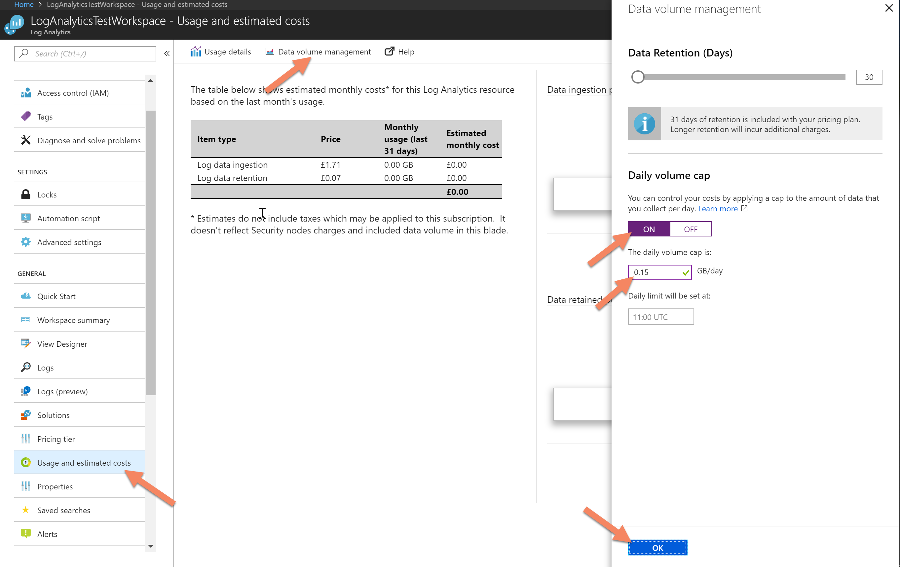

# Create Azure LogAnalytics Workspace

#This script will prepare Azure Subscription and Log Analytics workspace. This will be required if you want to send pChecks events to Azure Log for Monitor and further Automation

## Configure TLS

#Configure your machine for TLS 1.2 to allow smooth communication with Azure

New-Item 'HKLM:\SYSTEM\CurrentControlSet\Control\SecurityProviders\SCHANNEL\Protocols\TLS 1.2\Server' -Force
New-Item 'HKLM:\SYSTEM\CurrentControlSet\Control\SecurityProviders\SCHANNEL\Protocols\TLS 1.2\Client' -Force
New-ItemProperty -path 'HKLM:\SYSTEM\CurrentControlSet\Control\SecurityProviders\SCHANNEL\Protocols\TLS 1.2\Server' -name 'Enabled' -value '0xffffffff' –PropertyType DWORD
New-ItemProperty -path 'HKLM:\SYSTEM\CurrentControlSet\Control\SecurityProviders\SCHANNEL\Protocols\TLS 1.2\Server' -name 'DisabledByDefault' -value 0 –PropertyType DWORD
New-ItemProperty -path 'HKLM:\SYSTEM\CurrentControlSet\Control\SecurityProviders\SCHANNEL\Protocols\TLS 1.2\Client' -name 'Enabled' -value 1 –PropertyType DWORD
New-ItemProperty -path 'HKLM:\SYSTEM\CurrentControlSet\Control\SecurityProviders\SCHANNEL\Protocols\TLS 1.2\Client' -name 'DisabledByDefault' -value 0 –PropertyType DWORD
# set strong cryptography on 64 bit .Net Framework (version 4 and above)
Set-ItemProperty -Path 'HKLM:\SOFTWARE\Wow6432Node\Microsoft\.NetFramework\v4.0.30319' -Name 'SchUseStrongCrypto' -Value '1' -Type DWord
# set strong cryptography on 32 bit .Net Framework (version 4 and above)
Set-ItemProperty -Path 'HKLM:\SOFTWARE\Microsoft\.NetFramework\v4.0.30319' -Name 'SchUseStrongCrypto' -Value '1' -Type DWord

## Create Azure Resource Group and LA Workspace

Install-Module AzureRm
Import-Module AzureRm
Connect-AzureRmAccount

#Select subscription where Log Analytics workspace should be created
Get-AzureRmSubscription | Out-GridView -PassThru | Select-AzureRmSubscription

$resourceGroupName = 'RG-PSConf2020'
$Location = 'westeurope'
$workspaceSKU = 'standalone'
$workspaceName = 'LA-PSConf2020'

$newAzureRmResourceGroupSplat = @{
    Name = $resourceGroupName
    Location = $Location
}
New-AzureRmResourceGroup @newAzureRmResourceGroupSplat

$newWorkspaceSplat = @{
    ResourceGroupName = $resourceGroupName
    Location = $location
    Sku = $workspaceSKU
    Name = $workspaceName
}

New-AzureRmOperationalInsightsWorkspace @newWorkspaceSplat

## Set daily cap limit
<# 
Set daily cap limit for 0,15GB a day < 5GB a month (free tier)

If this resource group is operating on a free tier it's best to set up daily cap limit for 0,15GB. This will allow to gather logs thorughout the month and not exceed the free tier (5GB) withing few first day by mistake.

- Select the Usage & Billing blade
- Select the Data volume management tab
- Turn the Daily Volume Cap ON
- Set a volume which keeps you within your 5GB/month limit (e.g. 0.15GB/day)
- Press OK to apply the settings

#>